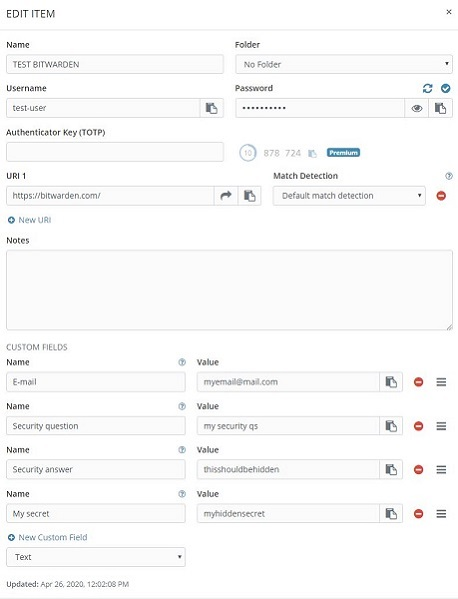

# Enpass-JSON-to-Bitwarden-converter-fix
Python script to fix the custom fields not being show as hidden on Bitwarden when importing Enpass JSON

## Summary
When importing an Enpass JSON file to Bitwarden, if you have custom fields that are hidden/marked as "Sensitive" on Enpass, they are imported as standard text fields in Bitwarden, not as hidden (tested on Version 2.13.2)

 

The python script will compare an Enpass JSON file with a Bitwarden JSON file. If it finds fields that should be hidden, it will correct the Bitwarden JSON. You can then import this new file to your vault.

DISCLAIMER: ALWAYS keep a backup of the JSON files in a secure place. This files will have all your passwords in plain text, so keep them in safe place and consider encrypting them/and put them in password protected zip. 
I do not take resposability of this script messing up or loosing info of your vault. 

## Pre-requisites
- Python3 (probably will work with Python2.7 or will need small adjustments)
- JSON python library (not sure if included by default on Python3 distribution)

This is how Enpass entry looks like, with sensitive information hidden:

## Instructions
1. Export your Enpass vault as JSON. Go to File -> Export. Select JSON and save the file to your desktop. Copy the file to the working directly and rename it to Enpass_vault.json
2. Open Bitwarden web https://vault.bitwarden.com/ (or your own self-hosted bitwaren) and login to with your username.
3. Navigate to Tools → Import Data. Choose from the dropdown Enpass(JSON) and select your previous created file. Upload it.
4. Check some of the items. On the photo below you can observe how the custom "Sensitive/password" fields at the bottom are not hidden with *** because of the incorrect import.

 

5. Go again to Tools → Export Vault.Choose JSON and put your Bitwarden password.
6. Copy the saved file (should have a format similar to "bitwarden_export_20200426121443.json" to the working folder and rename it as Bitwarden_exported.json
  IMPORTANT: COPY THE FILE, do not MOVE IT. Always keep the original backup Bitwarden file. 
7. Execute the python script. It will create a new Bitwarden_fixed.json file
8. You can check the output file Fixed_DELETE.txt to see which fields have been fixed. You can also compare the Bitwarden_exported.json with the Bitwarden_fixed.json file.

  **IMPORTANT: DELETE the Fixed_DELETE.txt file since it will have plain text visible password!**

9. Delete your Bitwarden vault. Go to Settings → At the bottom of the page, in the "Danger zone" box, click "Purge vault"
10. Import now the corrected file name Bitwarden_fixed.json Go to Tools → Import Data. Choose from the dropdown the first element, BITWARDEN(JSON) and select the Bitwarden_fixed.json file. Upload it.
11. Check again the items. The custom fields should now be correctly hidden when appropiate.

 

**REMEMBER to delete the Fixed_DELETE.txt file once you have finished and move all the JSON files to a secure place since they will have all your passwords.**
